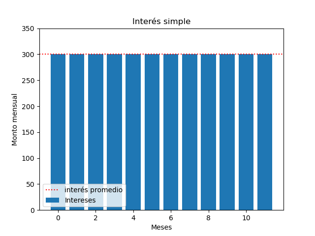

Cuando una persona utiliza un bien que no le pertenece, por lo genrar debe pagar una renta por el uso del mismo. Cuando se pide dinero prestado, por lo general se debe pagar una renta por su uso. La renta recibe el nombre de **interés**.

<!--more-->

>“El interés se define como el dinero que se paga por el uso del dinero ajeno.”

La cantidad de dinero tomada en prestamo se llama **capital** y el **monto** es la suma del capital más el interés ganado y se escribe como

$$F = P + I$$ 

La **tasa de interés** indica el costo que representa obtener dinero en préstamo y se expresa como un porcentaje del capital por unidad de tiempo.

Cuajdo el interés se paga al final de cada intervalo de tiempo acordado sin que el capital original varie se conoce como **interés simple**

### Ejemplo:
---
Imagine que invertirá \$20 000 a un plazo de 12 meses y a una tasa de interés simple de 1.5\% mensual.

cada mes estarás obteniendo $300 lo cual puede ser beneficioso para el que tomo prestado el dinero. Note que podemos calcular el interés que se va a obtener al finalizar el periodo de tiempo siguiendo la ecuación 

$$
I = P it
$$

Donde $i$ es la tasa de interes, $P$ el capital y $t$ el periodo de tiempo.
## Referencias
1. Manuel, H., & Aguirre, V. (2012). Matemáticas financieras . CENGAGE Learning.