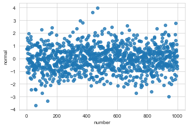

La inteligencia artificial ocupa en muchos de los modelos la teoría de la probabilidad y las herramientas de la estadística para la aproximación de funciones de distribución, la identificación de distribuciones o la trasnformación. Por ello es casual toparnos con muchas definiciones que debemos tener presente para llevar un mejor entendimiento en los modelos.
<!--more-->

Una variable aleatoria discreta es una función $X: \Omega \to \mathbb{R}$ que toma un número contable, posiblemente infinito $n\to\infty$, de un conjunto de valores discretors.

Tomemos por ejemplo el cojunto de variables aleatorias $X$ mostrado en la siguiente figura

Por el momento no queda más que aceptar que existe la función $X$ que toma un valor contable, posiblemente infinito si $n\to \infty$ del conjunto $x_1, ..., x_n$. Podemos de la variable aleatoria definir una función de probabilidad denominada *pmf* (probability mass function por sus siglas en ingles). La pmf ($p_x$) de una variable aleatoria es la función $p_X: \mathbb{R} \to [0,1]$ definida como 

$$
p_X(x_i) = P(X = x_i)
$$

Que se lee como, la función masa de probabilidad del elemeno $x_i$ es igual a la probabilidad de que la función varibable aleatoria $X$ tome exactamente el valor $x_i$ y su equivalente en conjuntos es 

$$
P(X\in B) = \sum_(x_i\in B)p_X(x_i)
$$

Esta función obedece los axiomas mencionados abajo, es decir para todo $x_i \in X$ la función $p_x$ es diferente de cero, la suma es uno y es cero para cualquier elemento que no este en $X$. 

A partir de la fmp, se puede construir una segunda función denominada *cdf* (cumulative distribution function) la cual se define como $F_X:\mathbb{R}\to[0,1]$

$$
F_X(x) = P(X\leq x)
$$

La función cdf de una variable aleatoria discreta es continua por partes por la derecha.
### Definiciones
- Una espacio muestral $\Omega$ es el conjunto de todas las salidas de un experimento.
- Un eveto es un subconjunto del espacio muestral.
- Dos eventos $A$ y $B$ son disjuntos si no tienen elementos en común. 

### Axiomas
- No negatividad: $P(A) >= 0$ para todo evento $A$.
- Normalización: $P(\Omega) = 1$
- Uniones disjuntas: para todos los eventos disjuntos $A_i$,  $P(A_1 \cup \cdots) = P(A_i) + \cdots$. 