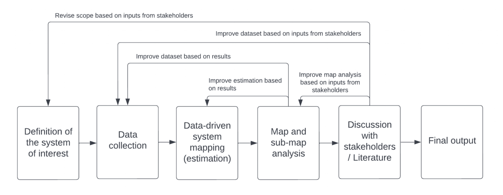

Un sistema mapeado con datos, es una aproximación diseñada para contextualizar, comunicar y entender las relaciones existentes en los datos. 

<!--more-->

Vamos a tener diferentes enmarañados de datos, pues la información en una primera etapa será unicamente con ese objetivo, el de acumular datos.

-----
## Contexto
Tomad de de Moura, F. S., & Barbrook-Johnson, P. (2022). Using data-driven systems mapping to contextualise complexity economics insights (No. 2022-27). Institute for New Economic Thinking at the Oxford Martin School, University of Oxford.

El mapeo de sistemas ha experimentado una inovación en el proceso de contruir y usar los mapas. El desarrollo de los modelos trae a la mesa diferentes preguntas entre ellas la de cómo el mapeo de sistemas deberia ser contruido o desarrollado el proceso de búsqueda y cómo se prodría extraes más valor de ello, como la posibilidad de ser usado para relacionar los resultados com modelos de fusqueda de procesos políticos y ampliar el conocimiento de la ciencia social.

Imagineos un ejercicio típico del mapeo de sistemas. Dado un sistema o política de interes, el gol principal es determinar los factores principales y las relaciones entre ellos. La salida es un proceso y una red que representa una visión de las fuerzas de trabajo lo que podría ser entendido y aplicado para ser covertido, por ejemplo, en el diseño de mejores políticas. 

Se busca mostrar que el mapeo de sistemas es una aproximación adecuada para contextualizar, embeber y comunicar ideas de sistemas complejos reales. También que puede haber un bunche de metodos para la estimación de redes que probeen una buena base para realisar el mapeo utilizando datos.

La metodología sigue los siguientes pasos. Se inicia por tener planteado el sistema de interes, es decir, conocer a priori los factores que componen el sistema y establecerlos. Después se aplican los métodos para encontrar las relaciones entre los factores del sistema, en nuestro caso estamos usando correlation thresholding y el algoritmo PC. Se pasa al análisis de los resultados y se plantean las modificaciones necesrias para hacer un ajuste, se puede recurrir a otros equipos especialozados que ayuden a refinar más el modelo. Una representación de este flujo se muestra en la siguiente figura. 

## Estimación de redes
Dos técnicas comunes para la estimación de redes es la de correlation thresholding y el algoritmo PC y relativamente fáciles de implementar y comunicar los resultados con otros expertos. En un modelo de red, los factores in el sistema de interes son conocidos como nodos y los enlaces entre ellos son llamados edges o vertices. Los cuales pueden tener dirección (orden) o no direccionados (no-ordenados). El significado de los vértices en la rd depende del método utilizado para crear las redes. Como ninguno de estos modelos es usado para detectar inferencia causal, nos referiremos a los enlaces como regularidades empiricas o relaciones, evitando el uso de lenguaje causal.

Los métodos vienen con un conjunto de normas y prácticas que nos hacen saber cómo deben ser aplicadas. Por ejemplo podemos usar p-valores altos con el fin de generar mapas más diversos, por ejemplo en densidad. Sin embargo se debe tener conciencia de que hacer esto es confines de poder, en los siguientes pasos, hacer un refinamiento de los resultados. 

## Correlation thresholding
Es una de las técnicas más comunes para la estimación de redes, en principio por su fácil implementación, interpretación y las bajas restricciones que se deben tener en las relaciones de las variables/factores. 

Para implementar el método hacen falta dos pasos, el primero es el de calcular una matriz complemta de correlación a un conjunto de nodos $X = {X_1, ..., X_n}$. Después, iniciando con una red vacia, para cada par de nodos $(X_i, X_j)$ en $X$, se irá rellenando el conjunto de vertices si entre los nodos la correlación y/o su p-value pas el valor seleccionado del tresholding. 

En nuestro caso no usamos la correlación de Pearson porque no estamos interasdos en identificar las relaciones lineales entre los nodos. 